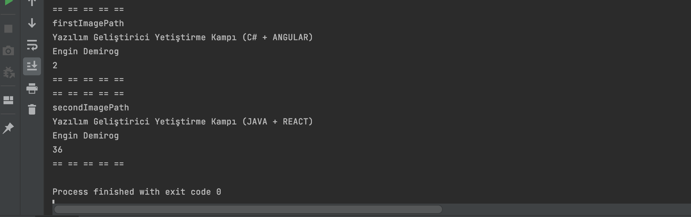

# Java Camp
In this repository, you can see what I have done and learned through this camp.

## Camp Details

Take a look at camp details:
- [kodlama.io](https://www.kodlama.io/)

## Projects

###[Day 1 - Intro](day1_intro)

Through this project, I've learned:
-	variables
-	conditional blocks
-	loops
-	arrays

in Java.

Screenshot of output:

---

###[Day 2 - oopIntro](day2_oopIntro)

Through this project, I've learned:
-	methods
-	classes
-	constructors
-	constructor overloading

in Java.

Screenshot of output:

---

###[Day 2 - Homework](day2_oopIntro)

In this project, I repeated what I learned in oopIntro.

Screenshot of output:

---
