# 
Java and React Camp

## 
Camp Details

In this repository, you can see what I have done and learned through this camp.

Take a look at camp details:
- [kodlama.io](https://www.kodlama.io/)

## 
Projects

### 1. Day - Project

1. [Intro](day01_intro)

Through this project, I've learned:
-	variables
-	conditional blocks
-	loops
-	arrays in Java.

Screenshot of output:

Output: Intro

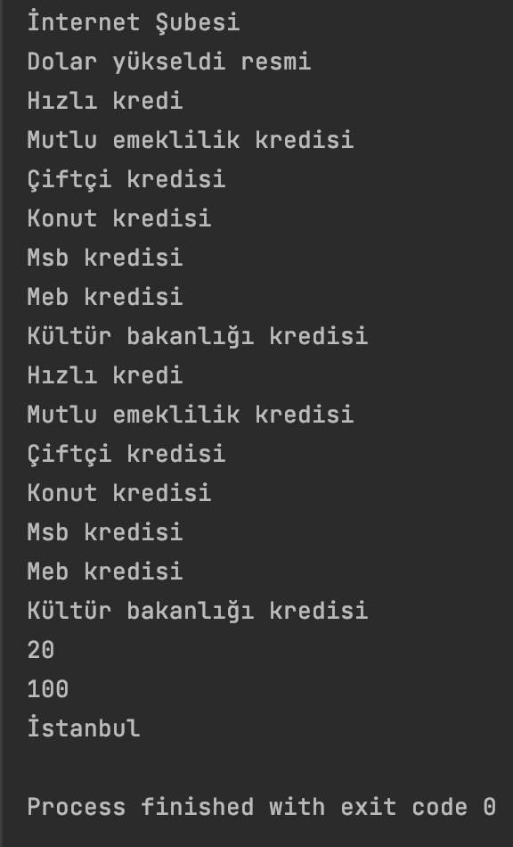

---

### 2. Day - Projects

1. [OopIntro](day02_oopIntro) 
2. [Homework](day02_homework)

Through these projects, I've learned:
-	methods
-	classes
-	constructors
-	constructor overloading in Java.

Screenshot of output:

Output: OopIntro

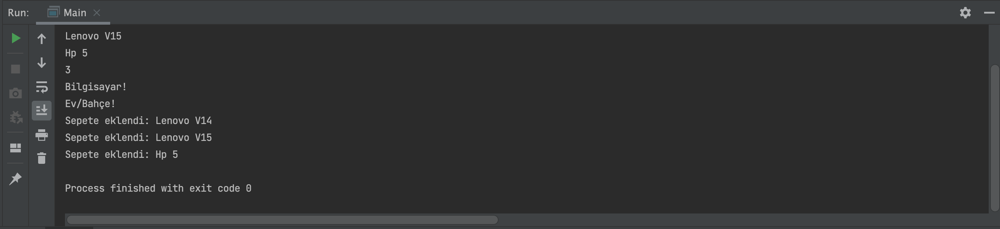

Output: Homework

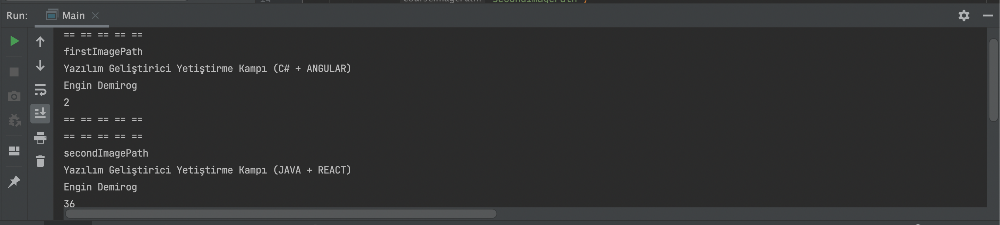

---

### 3. Day - Projects

1. [Inheritance](day03_inheritance) 
2. [Inheritance 2](day03_inheritance2)
3. [Homework](day03_homework)

Through these projects, I've learned:
-	getters
-	setters
-	inheritance
-	advanced level inheritance in Java.

Screenshot of output:

Output: Inheritance

Output: Inheritance 2

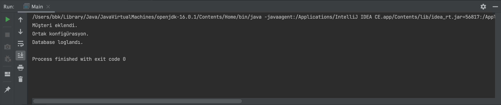

Output: Homework

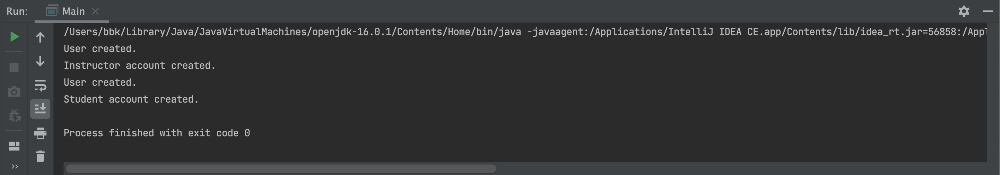

---

### 4. Day - Projects

1. [Interfaces](day04_interfaces) 
2. [Homework](day04_homework)
3. [Homework 2](day04_homework2)

Through these projects, I've learned:
-	interfaces
-	dependency injection
-	statics in Java.

Screenshot of output:

Output: Interfaces

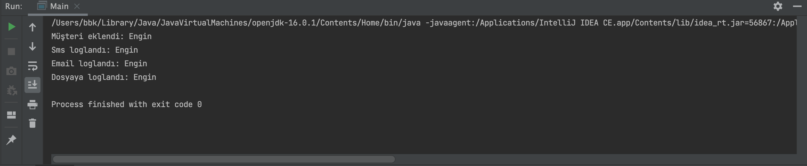

Output: Homework

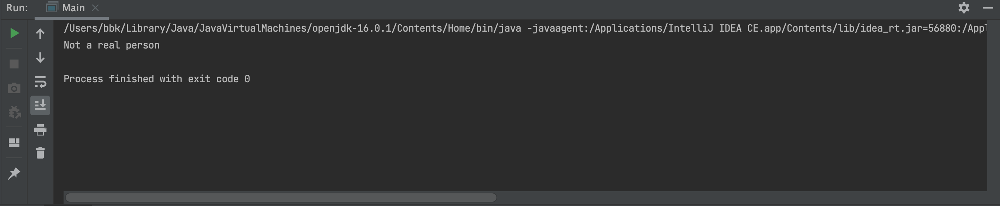

Output: Homework 2

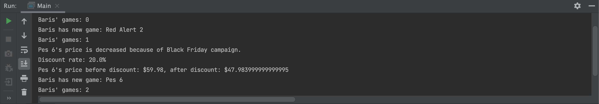

---

### 5. Day - Projects

1. [N-Layered Demo](day05_nLayeredDemo) 
2. [Homework](day05_homework)

Through these projects, I've learned:
-	N-Layered / 3-Layered Architecture
-   how write testable codes
-	how to implement microservices in Java.

Screenshot of output:

Output: N-Layered Demo

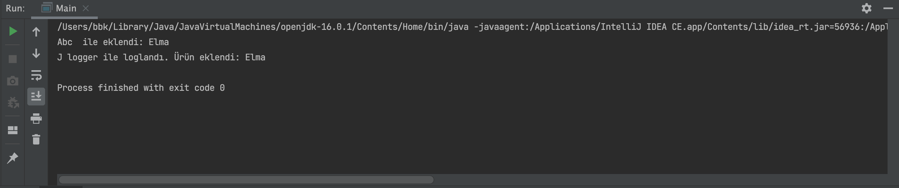

Output: Homework

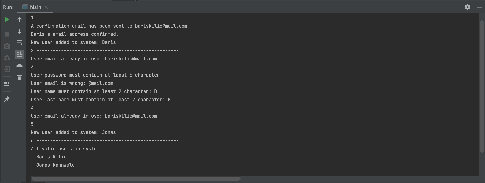

---

### 6. Day - Project

1. [Northwind](day06_northwind)

Through this project, I've started to learn about:
-	Spring Framework and Lombok
-   Autowired of Spring and how API handles requests
-	PostgreSQL and annotations in Java.

Screenshot of output:

Output: Northwind

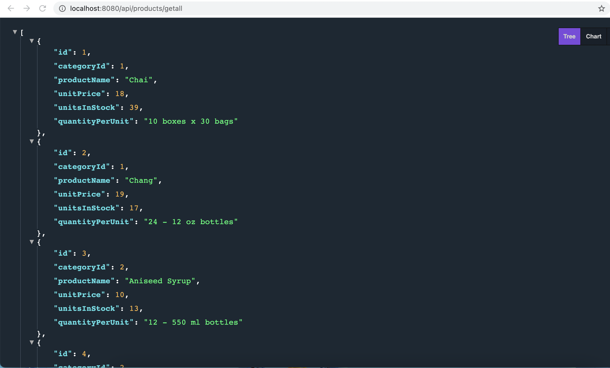

---

### 7. Day - Project

1. [Northwind](day07_northwind2)

Through this project, I've learned:
-	about Swagger. 
-	how to add Swagger and its dependencies to project. 
-	how to write API call result manager and its logic.
-   how to add data to database via API request.
-   how to create constructor with Lombok.

Screenshot of output:

Output: Northwind

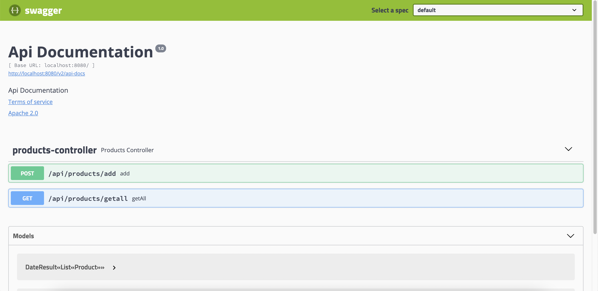

---

### 8. Day - Project

1. [Northwind](day08_northwind3)

Through this project, I've learned:
-	about @OnetoOne and @OneToMany. 
-	how to write JPA query.
-	how to implement these queries to service and API controllers.

Screenshot of output:

Output: Northwind

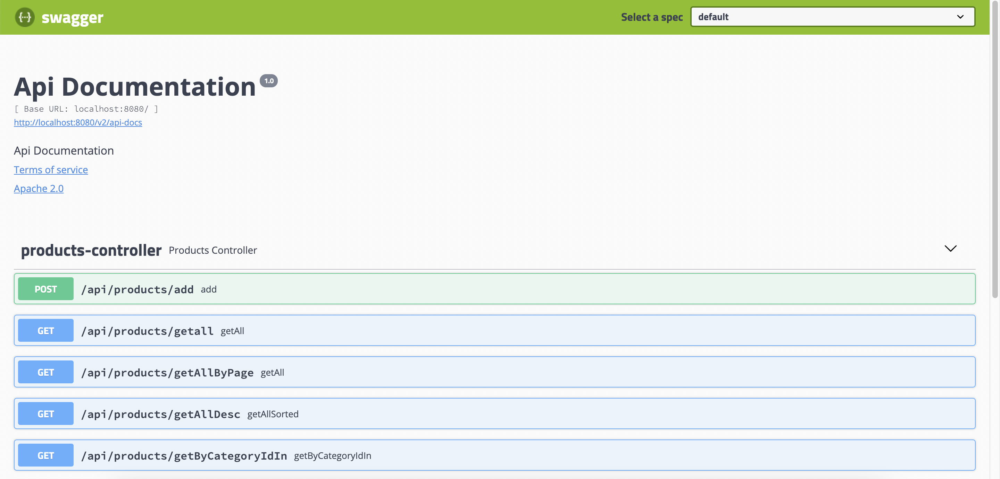

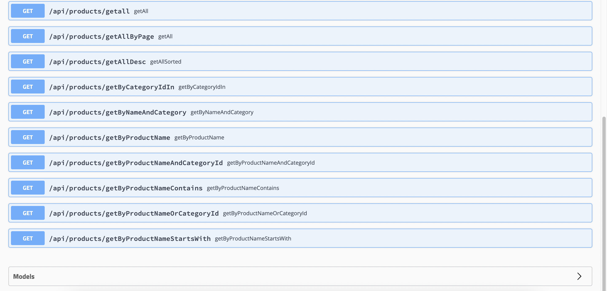

---

### 9. Day - Project

1. [Northwind](day09_northwind4)

Through this project, I've learned:
-	about DTOs
-	how to write SELECT query
-   about Spring Boot Validation and ResponseEntity
-   how to write Global Exception Handler
-   about Spring Boot ExceptionHandler/FieldError and MethodArgumentNotValidException.

Screenshot of output:

Output: Northwind

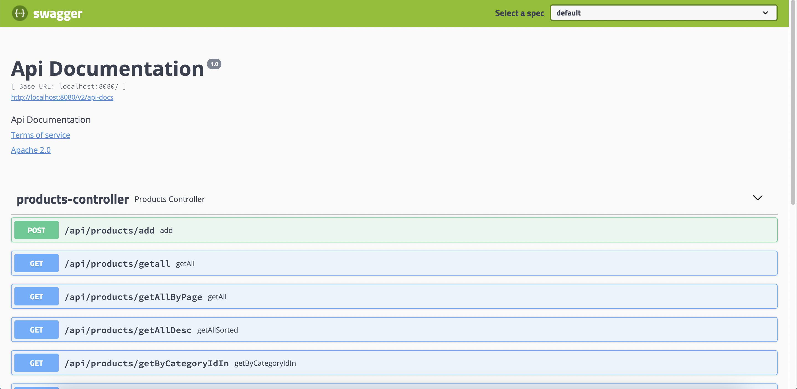

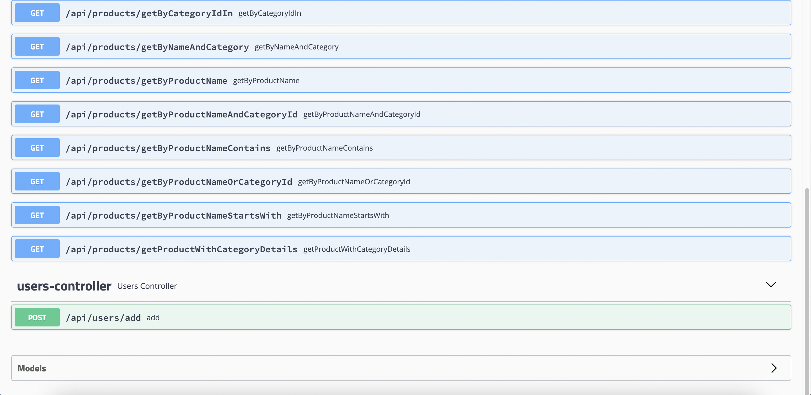

---

### 10. Day - Project

1. [JavaScript](day10_advancedJavaScript)

Through this project, I've learned:
-	difference between "var" and "let" in ECMAScript
-	functions in JavaScript
-   Undefined in JavaScript
-   Rest and Rest Parameter / Spread / Destructuring in JavaScript.
-   Classes / Prototyping in JavaScript

Screenshot of output:

Output: JavaScript

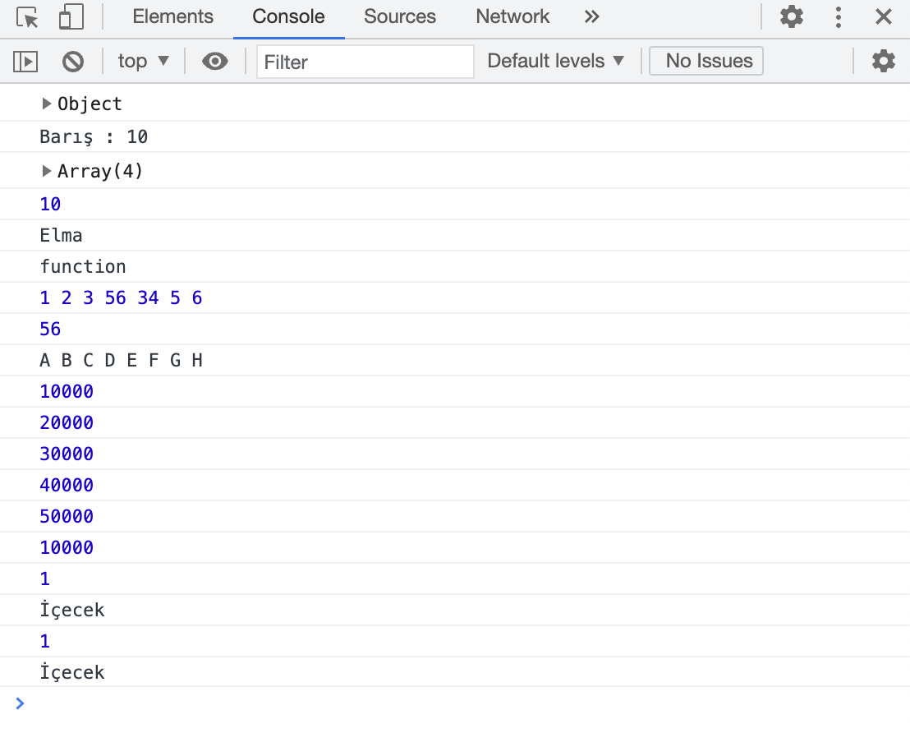

---

### 11. Day - Project

1. [ReactCampProject](day11_camp-project)

Through this project, I've learned:
-	about the fundamentals of React
-	about the fundamentals of Semantic-UI
-   how to get data to React App from API services.

Screenshot of output:

Output: ReactCampProject

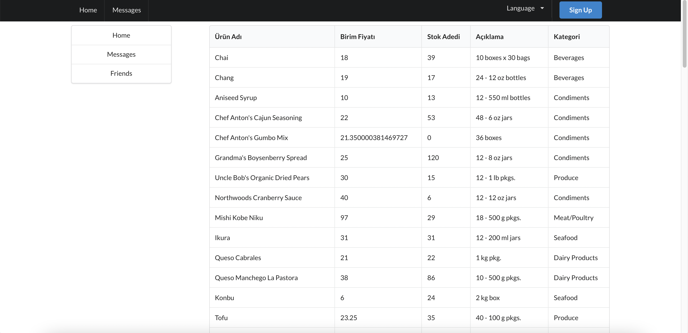

---